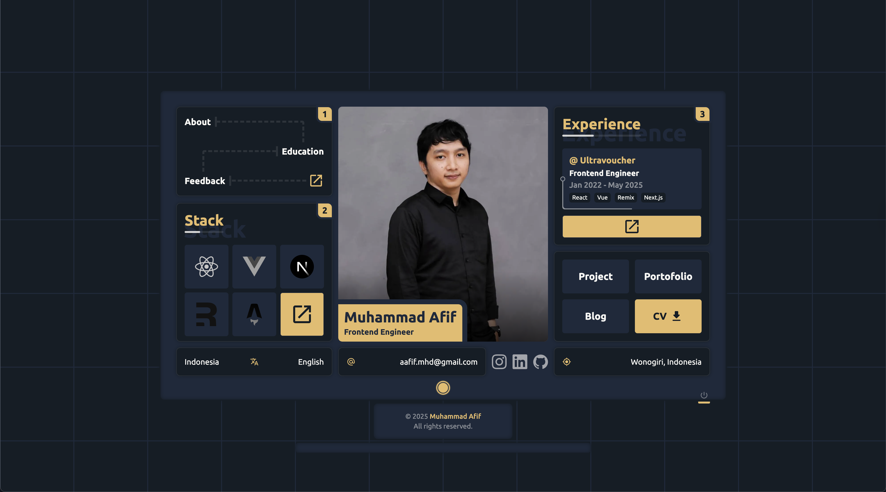

# 🌐 Personal Portfolio Website

Welcome to my personal portfolio website! This site showcases my projects, skills, and professional background.

🔗 **[aafif-mhd.vercel.app](https://aafif-mhd.vercel.app/)**



---

## 🛠 Built With

- **[Astro](https://astro.build/)** - a modern static site builder for lightning-fast websites
- **JavaScript** - interactive functionality
- **Tailwind CSS** - utility-first CSS framework for styling

---

## 🛠 Installation & Set Up

1. Install dependencies

   ```sh
   pnpm install
   ```

2. Start the development server

   ```sh
   pnpm dev
   ```

## 🧞 Building and Running for Production

1. Generate a full static production build

   ```sh
   pnpm build
   ```

1. Preview the site as it will appear once deployed

   ```sh
   pnpm preview
   ```

## 🚀 Project Structure

Inside of your Astro project, you'll see the following folders and files:

```text
aafif-mhd.vercel.app/
├── public/
│   └── favicon.svg
└── src/
    ├── assets
    ├── components/
    │   └── layout
    ├── modules/
    │   └── section
    ├── pages/
    │   └── index
    ├── styles
    ├── utils
    ├── .nvmrc
    ├── astro.config
    ├── package.json
    ├── readme
    └── tsconfig.json
```
